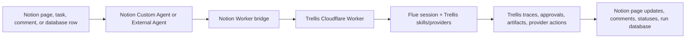

# Trellis + Notion Agent Integration Strategy

Date: 2026-05-14

## Summary

Notion's May 13, 2026 Developer Platform release is highly relevant to Trellis. It gives us a credible path to make Trellis GTM agents present inside Notion without moving Trellis execution into Notion.

The recommended strategy is:

1. Keep Trellis on Cloudflare as the execution plane.
2. Treat Notion as another operator surface, similar to Slack.
3. Start with Notion Worker tools that dispatch to Trellis.
4. Add a first-party `@trellis/notion` operator package.
5. Later, upgrade to native Notion External Agents and/or a Chat SDK adapter when the APIs stabilize.

This lets GTM teams build private, auditable agents in Trellis and operate them where their team already works: Slack for live collaboration and Notion for structured workflows, approvals, memory, and audit trails.

## What Notion Released

Notion released the Developer Platform on May 13, 2026. The important pieces for Trellis are:

- Notion Workers: hosted TypeScript/Node programs for syncs, agent tools, and webhooks. Public beta.
- Custom Agent tools: deterministic Worker tools that Notion Custom Agents can call. Beta.
- External Agents API: a way to bring external agents into Notion as native participants. Alpha/waitlist.
- Notion Agent SDK: a way to use Notion agents from other apps. Alpha/waitlist.
- Notion CLI, `ntn`: auth, Worker deploys, API requests, data-source commands, and file uploads.

Important constraint: Workers are free during the beta period, then begin using Notion credits starting August 11, 2026. That reinforces the architecture choice: Notion Workers should bridge and coordinate, while Trellis/Cloudflare should do the long-running GTM execution.

## Strategic Decision

Do not move Trellis into Notion.

Trellis should remain the source of truth for:

- execution
- traces
- approvals
- provider calls
- GTM workflow state
- model and tool orchestration
- skills
- MCP connections
- artifacts
- no-send and human handoff policy

Notion should become a collaborative operator surface where users:

- assign work to agents
- start GTM workflows from pages or database rows
- review outputs
- approve or reject drafts
- inspect run status
- preserve artifacts
- audit what happened

## Recommended Architecture



The Worker bridge should be intentionally thin. It should validate Notion context, call Trellis, and write back concise state. It should not duplicate the Trellis runtime.

## Product Framing

Build GTM agents once in Trellis. Operate them anywhere your team already works: Slack for live collaboration, Notion for structured workflows, approvals, memory, and audit trails.

The strategic value is that GTM engineers can build agents with:

- team-specific process
- private knowledge
- MCPs
- provider permissions
- observability
- approvals
- handoff methodology
- structured state

Then those agents become available to the whole team through familiar surfaces.

## Near-Term Build: Notion Worker Tools

Ship a small Notion Worker package that exposes Trellis tools to Notion Custom Agents.

Candidate tools:

- `trellis_start_signal`
- `trellis_get_status`
- `trellis_watch_trace`
- `trellis_approve_draft`
- `trellis_reject_draft`
- `trellis_create_account_brief`
- `trellis_build_campaign_plan`
- `trellis_run_prospect_research`
- `trellis_sync_artifact_to_page`

This gives immediate value without waiting for External Agents API access.

Expected lift: medium.

User effect:

- A user can ask a Notion Custom Agent to start or inspect a Trellis run.
- A Notion page or database row can become the launch point for a GTM workflow.
- Humans can approve or reject Trellis work from the workspace where they already collaborate.

## Medium-Term Build: `@trellis/notion`

Build a first-party Trellis Notion package, separate from Slack.

Core responsibilities:

- Notion page/database row -> Trellis signal
- Notion comment/mention -> Trellis thread message
- Trellis trace event -> Notion run database update
- Trellis approval -> Notion status/comment/action
- Trellis artifact -> Notion page or block
- Notion identity/workspace/page mapping -> Trellis thread and trace metadata

Suggested D1 mapping table:

```sql
CREATE TABLE IF NOT EXISTS trellis_notion_threads (
  trace_id TEXT NOT NULL,
  signal_id TEXT,
  trellis_thread_id TEXT,
  notion_workspace_id TEXT NOT NULL,
  notion_page_id TEXT,
  notion_database_id TEXT,
  notion_database_row_id TEXT,
  notion_comment_id TEXT,
  notion_agent_id TEXT,
  updated_at TEXT NOT NULL,
  PRIMARY KEY (trace_id, notion_workspace_id)
);
```

Expected lift: medium to high.

User effect:

- Notion becomes a durable workflow console for Trellis.
- Teams can track the same run across Trellis, Slack, and Notion.
- Operators get structured, searchable audit records in Notion without losing Trellis as the system of record.

## Later Build: Native External Agent

When Notion External Agents API access is available, add a native Trellis Notion adapter so Trellis agents appear as first-class Notion participants.

Target experience:

- `@mention` a Trellis GTM agent in a page or comment.
- Assign a database task row to a Trellis agent.
- Chat with a Trellis agent directly in Notion.
- Watch progress in the page, row, or thread.
- Approve drafts from the same Notion workspace.

Expected lift: high.

User effect:

- Trellis agents feel like team members inside Notion.
- GTM teams can build custom workflows instead of forcing work through off-the-shelf GTM tools.
- The team gets process-specific automation with auditability and human handoff.

## Chat SDK Position

As of this review, Chat SDK does not list a Notion adapter. Official adapters include Slack, Teams, Google Chat, Discord, GitHub, Linear, Telegram, WhatsApp, Messenger, and Web.

The practical path is:

1. Do not wait for Chat SDK to add Notion.
2. Build `@trellis/notion` against Notion Workers and the Notion API first.
3. If Notion's External Agents API exposes stable message, thread, mention, action, and webhook primitives, consider `@trellis/chat-adapter-notion`.
4. If the adapter is generally useful, propose it upstream later.

Important packaging note: Chat SDK reserves the `@chat-adapter/*` scope for official adapters, so a Trellis-built adapter should use a Trellis-owned package name first.

Expected lift for a Chat SDK adapter: medium, after Notion APIs stabilize.

User effect:

- Trellis could share more bot logic across Slack, Teams, Web, and Notion.
- Until then, a Trellis-specific Notion operator package is faster and less risky.

## GTM Agent Use Cases

High-value Notion workflows:

- Account research from a Notion Accounts database.
- ICP and campaign planning from a strategy page.
- Prospect QA before outbound activation.
- Meeting prep from account notes, CRM syncs, and prior artifacts.
- Approval workflows where drafts land in Notion and humans approve/reject there.
- Run dashboards showing trace status, artifacts, blockers, and next actions.
- Customer-success workflows that combine Notion notes, CRM data, and Trellis provider tools.

## Feature Impact Table

| Feature | Expected Lift | User Impact |
| --- | --- | --- |
| Notion Worker tools | Medium | Lets Custom Agents call Trellis immediately from Notion. |
| `@trellis/notion` operator package | Medium to high | Creates a durable Notion surface for runs, artifacts, approvals, and audit trails. |
| Notion run database sync | Medium | Gives teams a searchable source of run status inside Notion. |
| Notion approval actions | Medium | Keeps humans in control from their normal review workspace. |
| Artifact-to-page sync | Medium | Turns Trellis outputs into durable team knowledge. |
| Native External Agent adapter | High | Makes Trellis agents first-class Notion participants that can be mentioned, assigned work, and tracked. |
| Chat SDK Notion adapter | Medium, later | Reduces duplicate messaging adapter code if Notion primitives are stable enough. |

## Risks And Constraints

- External Agents API is alpha/waitlist, so it should not block v1.
- Notion Workers will use Notion credits after the beta period, so long-running execution should stay in Trellis/Cloudflare.
- Notion should not become the source of truth for Trellis execution state.
- Worker tools must preserve Trellis approval, no-send, and provider safety gates.
- Notion comments/pages should receive summaries and links, not raw prompts, private provider payloads, or sensitive draft internals.
- Chat SDK does not currently provide a Notion adapter, so any adapter work is speculative until Notion's APIs are stable.

## Proposed V1 Scope

Build `@trellis/notion` as an operator bridge:

- `POST /webhooks/notion` or Worker-to-Trellis signed calls.
- Tool: `trellis_start_signal`.
- Tool: `trellis_get_status`.
- Tool: `trellis_approve_draft`.
- Tool: `trellis_reject_draft`.
- Tool: `trellis_sync_artifact_to_page`.
- D1 mapping table for Notion workspace/page/row to Trellis trace/thread.
- Redacted trace summaries written to a Notion run page or database row.
- No raw token streaming into Notion for v1.

Definition of done:

- A Notion Custom Agent can start a safe Trellis workflow.
- The Trellis trace is visible in Notion as status updates.
- A draft approval can be approved or rejected from Notion.
- Trellis remains the canonical runtime and trace store.
- Failure to update Notion records a trace event but does not block Trellis execution.

## Sources

- Notion release, 2026-05-13: https://www.notion.com/releases/2026-05-13
- Notion Developer Platform announcement: https://www.notion.com/en-gb/blog/introducing-developer-platform
- Notion Workers overview: https://developers.notion.com/workers/get-started/overview
- Notion Worker agent tools guide: https://developers.notion.com/workers/guides/tools
- Notion CLI overview: https://developers.notion.com/cli/get-started/overview
- Chat SDK platform adapters: https://chat-sdk.dev/docs/adapters
- Chat SDK adapter contribution guide: https://chat-sdk.dev/docs/contributing/building
